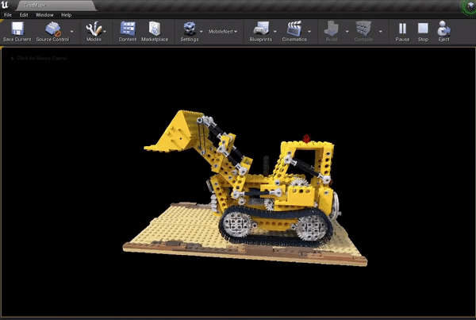

# UnrealMobileNeRF Plugin



## About
**UnrealMobileNeRF** is a plugin for Unreal Engine that allows for importing pre-trained MobileNeRF scenes and creating assets that you can use in-editor or in packaged projects.


**MobileNeRF** is an optimized NeRF representation that relies on textured polygons to make use of the standard rendering pipelines instead of raymarching algorithms. 
You can read more about MobileNeRF in their official page: [MobileNeRF: Exploiting the Polygon Rasterization Pipeline for Efficient Neural Field Rendering on Mobile Architectures](https://mobile-nerf.github.io/)

*Please note, that this is an unofficial port of the Web Brower Live Demo that comes with the paper. I am not affiliated with the original authors or their institution.*

## Usage

* Start by cloning the repository under your project's **Plugins** folder. You should end up with something like *YourProjectName/Plugins/UnrealMobileNeRF*

* Recompile your project, so the plugin will be built from source.

* Open your project in the Editor, you should now see a new button next to the settings button in the level editor toolbar.

* You can choose from the drop-down menu whether you want to import a **360°** or **Forward-Facing** MobileNeRF scene. A directory dialog will open up and you can pick the folder where the pre-trained MobileNeRF exists. Make sure this folder contains all the required files (mpl.json, OBJs, and PNGs).

* After choosing the folder, you can choose whether to enable optimizations (You can read about these in the details section) or to use the original paper implementation. 

* The plugin then starts creating/importing all the necessary assets. You should end up with a new folder under *Content/MobileNeRFScenes/*. Check the details section for the full list of the assets that you'll find under that folder. The most important asset is a StaticMesh with the name **SceneNameCombined**, which you can drag and drop into your level.


## Pre-Trained Scenes
You can train your own MobileNeRF scenes following the [official Github repository](https://github.com/google-research/jax3d/tree/main/jax3d/projects/mobilenerf).

There are also some sample scenes provided in the official live demo. In the plugin folder, you can find a python script that you can use to download them. The script uses wget python library to download the files so you need to make sure that's installed beforehand. 

```
pip install wget 
```
You can then run the script by specifying the path where you want to download the files, and a sample scene name, or alternatively use the *--all* flag to download all the available sample scenes.

```
python "path/to/plugin/DownloadMobileNeRFSamples.py "Path/where/to/download/"--name SceneName" 
```

The folder of the pre-trained MobileNeRF scene should contain the following files, that are required by the plugin:
- The JSON file, contains the weights for the MLP.
- All the OBJ files with the naming convention: shapeX.obj or ShapeX_Y.obj when the same shape is divided into different OBJs.
- Two PNG files per shape, with the naming convention: shapeX.pngfeat0.png and shapeX.pngfeat1.png

## Details

### Created Assets
The plugin will create the following assets in your projects:
* Texture2D asset for each Imported PNG.
* Static Mesh for each imported OBJ file, these will use high-precision UVs.
* 3 Texture2D that contain the weights of the MLP.
* Base Material that uses the shared weight textures and has the biases hardcoded in its shader.
* Material Instance Constant for each shape. These inherit from the Base Material and use the appropriate feature textures.
* MobileNeRF Custom Asset contains information about the imported scene and references the necessary assets.
* One Combined Static Mesh; the result of merging all the shape meshes.


### Optimizations
The material used for rendering the MobileNeRF scenes runs a small MLP network for every fragment on the screen. If you enable the optimizations when importing, the plugin will introduce the following optimizations to the network evaluation shader code:
* Create packed textures (RGBA) instead of single channel textures for the weights. This allows for fetching 4 weights at a time in the shader.
* Make use of vector Multiply-Add operations instead of the original scalar operations.

### Unreal Tonemapper
The colors of the mobileNeRF scenes are supposed to be displayed exactly as they are. That's why Unreal's Tonemapper can make the colors look a bit washed out. To completely disable the tonemapper, you can use a Post-Processing Volume and the ToneMapperReplacer Material provided in the plugin's content.


*Note: This plugin was made and tested with Unreal Engine 4.27*


## References
* [MobileNeRF Official Page](https://mobile-nerf.github.io/)
* [MobileNeRF-Unity-Viewer](https://github.com/julienkay/MobileNeRF-Unity-Viewer)
